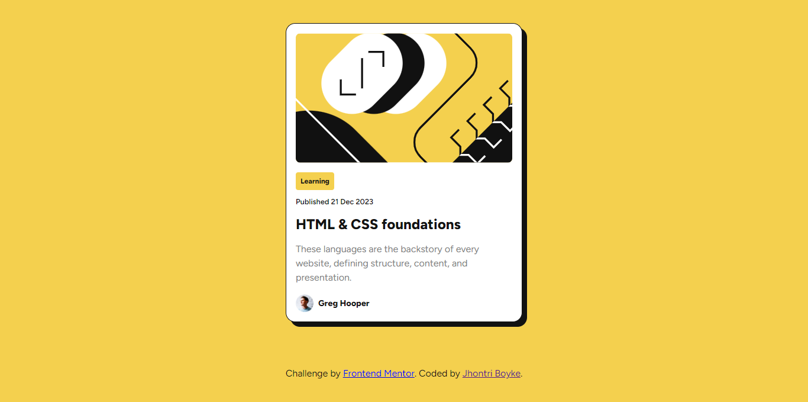

# Frontend Mentor - Blog preview card solution

Frontend Mentor challenges help you improve your coding skills by building realistic projects.

## Table of contents

-   [Overview](#overview)
    -   [The challenge](#the-challenge)
    -   [Screenshot](#screenshot)
    -   [Links](#links)
-   [My process](#my-process)
    -   [Built with](#built-with)
-   [Author](#author)

## Overview

### The challenge

Users should be able to:

-   See hover and focus states for all interactive elements on the page

### Screenshot

.png>)

### Links

-   Live Site URL: [Add live site URL here](https://moonlit-basbousa-bfb627.netlify.app/)

## My process

### Built with

-   Semantic HTML5 markup
-   CSS custom properties
-   Flexbox
-   CSS Grid
-   Mobile-first workflow

## Author

-   Frontend Mentor - [Jhontri Boyke](https://www.frontendmentor.io/profile/jhontriboyke)
-   Twitter - [@BoykeJhontri](https://www.twitter.com/BoykeJhontri)
