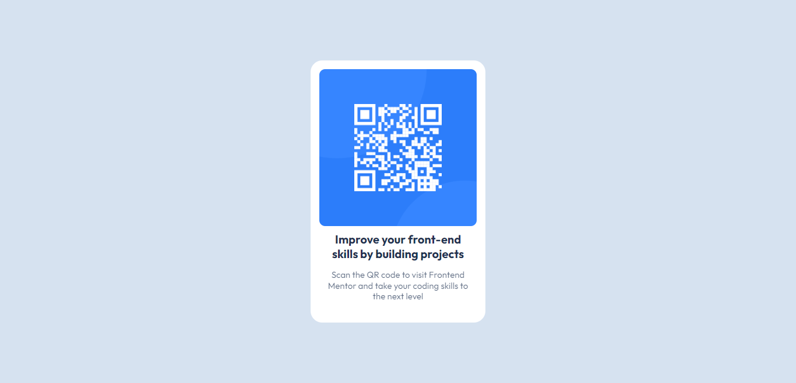

[Live Demo](https://jhontriboyke.github.io/fem-qr-code/)

# fem-qr-code

Front End Mentor - QR Component Project

### Screenshot

### Built with

-   Semantic HTML 5 Markup
-   CSS Flexbox
-   Patience, exciting, and curioustiy :D

## Colors

-   White: hsl(0, 0%, 100%)
-   Light gray: hsl(212, 45%, 89%)
-   Grayish blue: hsl(220, 15%, 55%)
-   Dark blue: hsl(218, 44%, 22%)

## Typography

### Body Copy

-   Font size (paragraph): 15px

### Font

-   Family: [Outfit](https://fonts.google.com/specimen/Outfit)
-   Weights: 400, 700

## What I learned

-   I finally can use css flex-box to build something
-   I get confused first when trying to center the container in body, so I set height: 100vh to body

## What should I do next

-   Try to update this when find better techniques later
